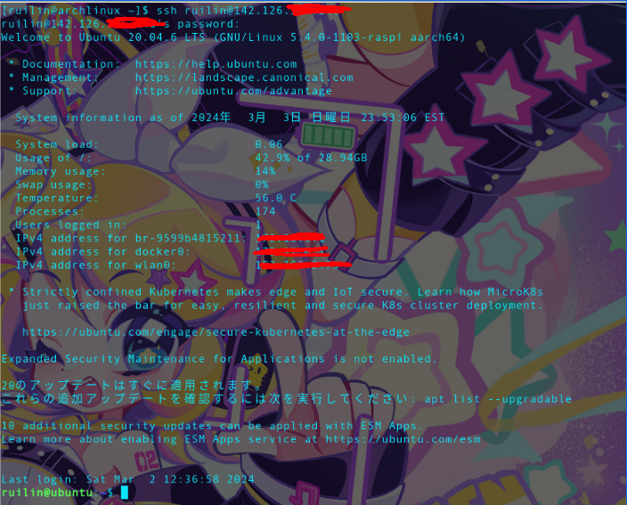

# Guide for setting up home server with Ubuntu Server Edition

## Introduction
If you ever developed a discord bot, you might wonder how things just work as long as we have the either python or javascript files running on our computer. That is because the either python or javascript are serving as the backend of the discord bot, and this also shows us that any computer can be used as a server.  

Thus instead of paying for cloud services such as AWS, turning a spare computer into a web server might be already enough for development purpose. Not only can you save the cost, but this also gains you some invaluable experience of server administration.And in this guide, I will be showing how this can be done with Ubuntu server edition, a popular and well-supported distro, and a piece of minimum hardware- a Raspberry pi 4b.

## Requirements

Before we hop into the setup, we need to make sure we have everything we need: The device, ethernet access or WLAN which we also needs the access to the router setting.

## About Ubuntu Server LTS 20.04
Ubuntu is a famous Linux distribution based on Debian. While unlike the standard edition which comes with display manager, desktop environment, daily software such as libreoffice, the server edition comes with minimum installation, only stuffs like apache2 which are needed to run a minimum server. It will be a very different experience if one worked only in a desktop environment, since we will be working in ttys(teletype writer, but takes it for terminal for simplicity) the most of the time.


## Installation of the OS

Depending on the device, there are two usual options. If it is something like x86_64, one can download and flash the image to a drive and then live boot into the target device, following the instruction to install it. Or if it is arm like I did on my rpi4b, the image needs to be flashed into the SD card and no installation is needed. 

## Connection to Internet
The very first task that needs to be completed after the installation of the system is to connect to the Internet. And by connect to Internet I mean two way: both that the device can access the Internet and accessed from the Internet.  

Let's begin writh accessing the Internet. There are two options as well, either ethernet cable or WLAN. The second one is the tricky one, as there is no for example a button you can click on and having a graphic Interface you can see all the ssid and just input password. The default way to connect wirelessly is a tool so called "netplan" and the configuration is located at `/etc/Netplan/` where we can see a yaml file. Use `sudo nano <xxx.yaml>` to edit it in the following format:

```
# This file is generated from information provided by the datasource.  Changes
# to it will not persist across an instance reboot.  To disable cloud-init's
# network configuration capabilities, write a file
# /etc/cloud/cloud.cfg.d/99-disable-network-config.cfg with the following:
# network: {config: disabled}
network:
    version: 2
    wifis:
        wlan0:
            optional: true
            access-points:
                "BELL309":
                    password: "14717219F1E1"
            dhcp4: true  

```
replace "BELL309" with the actual SSID and password as the corresponding password. press `ctrl+o` and `ctrl+x` to save and exit nano. After that `sudo netplan -debug generate` to check if there is any syntax error in the yaml. After verification is done `sudo reboot` to reboot. After reboot, the system shall automactically connect to the WLAN. use `ip a` or `ping google.com` to verify.  

Great, next, as a server, we also needs to make sure that the device is accessible from the Internet. This requires port forwarding from the router.
In browser of another computer, log into the router through its private ip address in the local area network. 

Then in "Port forwarding", select the device either from device name or local ip address(192.168.x.x) and set up a few ports fowarding we need. For example, 22 for ssh, 80 for http, and 443 for https. After saving the configuration, we can try access the global ip of the browser(You can figure this one out really quick by googling "ip" on any other device connected to the same network) like the following: 

If you can see such a page, congratulation, your server is now also accessible from Internet.
## Installation of necessary tools using apt

After making sure that the device can access the internet, the next step is to install the packages we need. The easiest way to do that in a tty is to use the package manager.
```
$ sudo apt update
$ sudo apt install openssh-server
$ sudo apt install git
...(any other tools you need for your development purpose, like nodejs)
```

## SSH
In order for ssh to work, we need to first enable it. After installing the package which should automatically enable the service as in previous step, `sudo systemctl status ssh` to double check. If it's blocked by UFW, `sudo ufw allow ssh`.  

To ssh from another device, in the other device's terminal
`ssh <username>@<ip address of the router>` like this:

and work the same way as in tty but copy pasting would be much more convenient since on the host device there is only terminal based browser and no cursor.

## Web Server Example

As a server, it needs to serve something. The most common thing to serve would be an web app. For example, I have a web app running in a docker and listening on port 4000 on this device, while port forwarding directly from 80 to 4000 on router would technically work, it is recommended to have a web server that does the reverse proxy. 
## Further reading

## External Resources